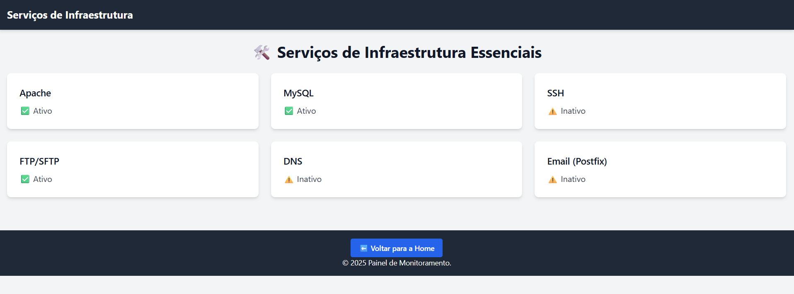
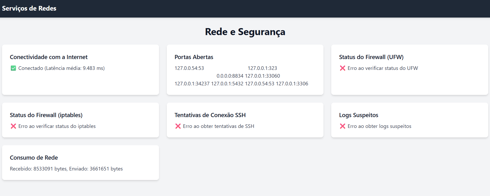
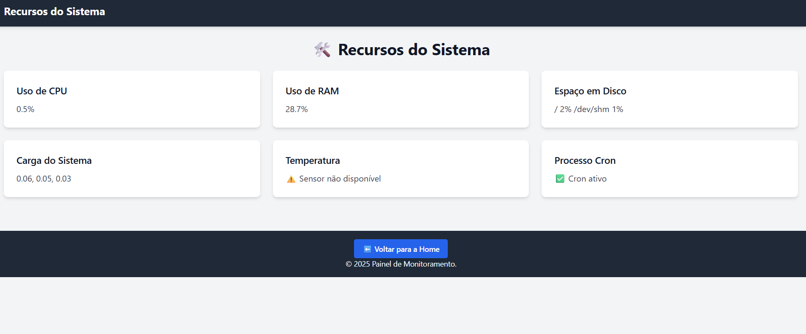

# Monitor Dashboard

O **Monitor Dashboard** é uma aplicação web desenvolvida em PHP que fornece uma interface amigável para monitorar métricas de infraestrutura, serviços essenciais, recursos do sistema e status de rede.  
Serve para administradores de sistemas e profissionais de TI que desejam acompanhar o desempenho e a saúde de seus servidores e serviços de forma centralizada e visualmente organizada.  
Durante o desenvolvimento usei o Ubuntu via WSL.  

## Funcionalidades

O painel é dividido em três seções principais, acessíveis a partir da página inicial:

1. **Serviços Essenciais**:
   - Monitora o status de serviços críticos como Apache, MySQL, SSH, FTP/SFTP, DNS e Postfix.
   - Exibe se os serviços estão ativos, inativos, falharam ou possuem status desconhecido.

2. **Rede e Segurança**:
   - Verifica conectividade com a internet e latência média.
   - Lista portas abertas no servidor.
   - Mostra o status de firewalls UFW e iptables.
   - Exibe tentativas de conexão SSH e logs suspeitos.
   - Apresenta o consumo de rede por interface.

3. **Recursos do Sistema**:
   - Monitora o uso de CPU, RAM e espaço em disco.
   - Exibe a carga do sistema e a temperatura do processador.
   - Verifica se o processo `cron` está ativo.

## Estrutura do Projeto

O projeto está organizado da seguinte forma:

```
monitor-dashboard/
├── index.php                   # Página inicial do painel
├── funcoes/                    # Funções PHP para o monitoramento
│   ├── verificar_rede.php      # Funções relacionadas à rede
│   ├── verificar_servicos.php  # Funções relacionadas à serviços
│   └── verificar_sistema.php   # Funções relacionadas à recursos do sistema
├── paginas/                    # Páginas do painel
│   ├── rede.php                # Página de rede
│   ├── servicos.php            # Página de serviços
│   └── sistema.php             # Página de sistema
├── template/                   # Templates
│   ├── header.php              # Cabeçalho do site
│   └── footer.php              # Rodapé do site
├── image/                      # Pasta de imagens
│   └── background.webp         # Imagem de fundo da página inicial (fonte: lexica.art)
```

## Requisitos

- **Servidor Web**: Apache, nesse caso.
- **PHP**: Versão 7.4 ou superior.
- **Dependências do Sistema**:
  - `mpstat` (para monitorar CPU).
  - `free` (para monitorar RAM).
  - `df` (para monitorar disco).
  - `uptime` (para carga do sistema).
  - `sensors` (para temperatura do processador).
  - `systemctl` (para verificar serviços).
  - `ss` ou `netstat` (para listar portas abertas).
  - Permissões para executar comandos `sudo` (para firewalls e logs).

## Instalação

1. Clone o repositório para o diretório do servidor web:
   ```bash
   git clone https://github.com/TheEddu/monitor-dashboard.git
   ```

2. Certifique-se de que o servidor web tenha permissão para executar os scripts PHP.

3. Configure as permissões necessárias para que o PHP possa executar comandos do sistema:
   ```bash
   sudo visudo
   ```
   Adicione a seguinte linha para permitir que o usuário do servidor web execute comandos específicos sem senha:
   ```
   www-data ALL=(ALL) NOPASSWD: /usr/sbin/ufw, /sbin/iptables
   ```

4. Acesse o painel no navegador:
   ```
   http://localhost/monitor-dashboard/
   ```

## Uso

- Acesse a página inicial para navegar entre as seções do painel.
- Clique em "Serviços Essenciais", "Rede e Segurança" ou "Recursos do Sistema" para visualizar as métricas correspondentes.
- Utilize as informações exibidas para identificar problemas ou otimizar o desempenho do servidor.

## Capturas de Tela

### Página Inicial


### Monitoramento de Serviços


### Monitoramento de Rede


### Monitoramento de Sistema


---

Com o **Monitor Dashboard**, podemos simplificar o gerenciamento de servidores e trabalhar para que a infraestrutura esteja sempre funcionando de forma eficiente.